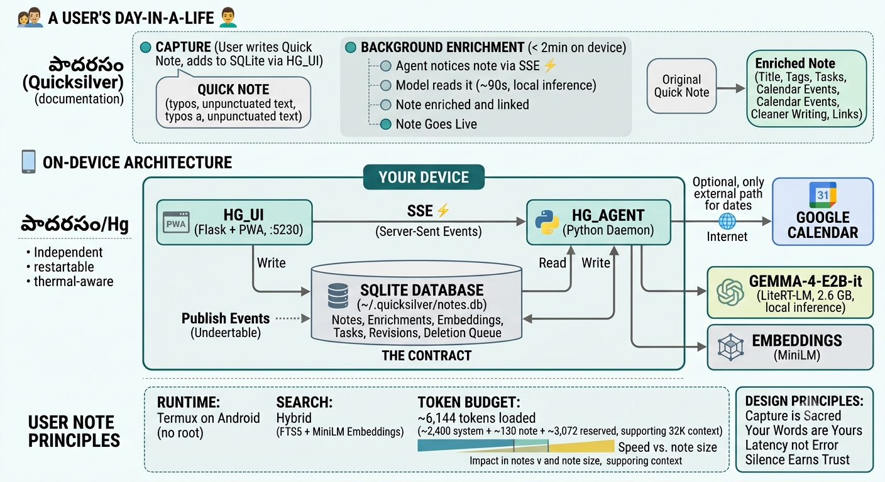

# పాదరసం · Quicksilver

<p align="center">
  <strong>A notebook that thinks about your notes, without sending them anywhere.</strong>
</p>

<p align="center">
  <a href="https://github.com/adabalap/quicksilver/stargazers"></a>
  <a href="https://github.com/adabalap/quicksilver/issues"></a>
  <a href="https://github.com/adabalap/quicksilver/commits/main"></a>
  
</p>

<p align="center">
  <strong>On-device · Offline-capable · No Quicksilver account · No Quicksilver cloud</strong>
</p>

Quicksilver is a local-first, AI-assisted notebook that runs on Android through Termux. Write the way you would write on paper: fast, messy, incomplete, and unpunctuated. A local AI agent quietly turns each note into something easier to find and act on by adding a title, tags, a summary, related notes, extracted tasks, reminders, and semantic search data.

Your note is saved immediately. AI enrichment runs asynchronously and never blocks capture.

> **పాదరసం** means *quicksilver*. It moves, it joins, it does not stain.

<p align="center">
  <a href="https://hg.adabala.com/about.html">Explore the live About page</a>
  ·
  <a href="#getting-started">Get started</a>
  ·
  <a href="https://github.com/adabalap/quicksilver/issues">Report an issue</a>
  ·
  <a href="https://github.com/adabalap/quicksilver/discussions">Join the discussion</a>
</p>

## Why Quicksilver?

Most AI note workflows depend on a hosted service. Quicksilver takes a different approach.

| Typical cloud AI notebook | Quicksilver |
|---|---|
| Notes are sent to a hosted model | Language-model inference runs on the device |
| Capture may wait for AI processing | Capture is immediate and enrichment is asynchronous |
| An account or hosted backend is required | No Quicksilver account or cloud service is required |
| Loss of connectivity can interrupt AI features | Core capture and local enrichment are designed to work offline |
| AI is part of the critical path | AI is an enhancement layer, not a notebook dependency |

**The simplest explanation:** write a rough note, save it, and move on. Quicksilver organizes it locally in the background.

## See It in Action

> Add a short demo GIF or video preview here. A strong demo should show a rough note being captured, enriched, linked, and found through semantic search.

<!-- Replace the placeholder below after adding your demo asset. -->
<!--
<p align="center">
  <a href="YOUR_DEMO_VIDEO_URL">
    
  </a>
</p>
-->

A useful 60-second demo flow:

1. Capture an unstructured note.
2. Save it instantly.
3. Show the generated title, tags, summary, tasks, and reminder.
4. Open a semantically related note.
5. Find the original note using a concept that was not written verbatim.
6. End with: **On-device. No account. No cloud.**

## What It Does

### 🏷️ Creates meaningful titles and tags

Every note receives a useful title and a small set of tags, so a growing notebook stays searchable instead of becoming a wall of first lines.

### ✍️ Tidies writing without losing the original

Optional polishing cleans up typos, broken grammar, and dictation slips while preserving names, numbers, and quotations. The pre-polish text remains available in revision history.

### ✅ Pulls tasks out of ordinary sentences

A sentence such as:

> I should ping David.

can become a structured task in the Actions list without being entered twice.

### 🗓️ Turns written dates into reminders

A phrase such as:

> Next Monday at 2 PM.

can become a calendar event. Vague dates remain pending rather than being guessed.

### 🔗 Connects notes by meaning

Notes about the same subject can link to one another even when they do not share the same keywords.

### 🔍 Supports semantic and keyword search

Search for an idea such as “that vendor conversation” and retrieve the relevant note even if the original wording was different.

## A Note's Journey

1. **You capture**  
   Type or dictate. The note is stored and readable immediately. Nothing waits on the AI.

2. **The agent notices**  
   A background process observes the database, using a live event stream for low-latency notification and polling as a safety net.

3. **The model reads it**  
   A local language model generates a title, summary, tags, tasks, reminders, and, when enabled, a cleaner version of the text.

4. **The note is linked and filed**  
   An embedding represents the note semantically so it can be compared with other notes and linked in both directions.

5. **The enrichment goes live**  
   The improved note becomes available automatically. The original remains accessible in revision history.

The note remains usable throughout. Enrichment adds value without blocking capture.

## Architecture

Quicksilver uses two independent processes connected through a shared SQLite database. `hg_ui` handles capture and retrieval, while `hg_agent` performs asynchronous enrichment using local inference.

<p align="center">
  <a href="docs/images/quicksilver-architecture.png">
    
  </a>
</p>

<p align="center">
  <em>A note is available immediately after capture. Enrichment happens asynchronously and on-device, with Google Calendar as the optional external path for dates.</em>
</p>

> The diagram must be committed at `docs/images/quicksilver-architecture.png` for GitHub to render it.

### Two processes, one durable contract

The interface and agent do not depend on a synchronous application API. Both operate against the same SQLite database.

- `hg_ui` saves notes and provides the notebook experience.
- `hg_agent` detects pending work and writes enrichment back.
- SQLite stores notes, enrichments, embeddings, tasks, reminders, revisions, and durable deletion work.
- Server-Sent Events reduce detection latency but are not required for correctness.
- Gemma performs local language-model inference.
- MiniLM creates embeddings for semantic retrieval and related-note discovery.
- Google Calendar is optional and is used for calendar events derived from dates in notes.

Either process can be restarted, upgraded, or stopped independently. If the agent is unavailable, Quicksilver remains a usable notebook and pending notes can be enriched after the agent resumes.

### Why the database is the interface

A synchronous HTTP API would make the agent a runtime dependency of the notebook. If the daemon were restarting or unavailable, an AI-related call could fail during an operation that should not require AI.

SQLite changes the failure mode from **error** to **latency**. A note captured while the agent is unavailable remains safely stored and can be enriched later. The database is both the source of truth and the durable contract between the two processes.

## Your Control

The AI is a collaborator with explicit limits. The mode is selected per note.

| Mode | Enrichment | Note text |
|---|---|---|
| **Full** | Title, tags, summary, tasks, reminders, and rewrite | Rewritten, with original retained |
| **Metadata** | Title, tags, summary, tasks, and reminders | Untouched |
| **Off** | None | Untouched |

- **Off** takes effect immediately.
- **Full** and **Metadata** shape the next enrichment run.
- A mode selected for one note does not silently change later notes.
- A rejected task is remembered and does not return on the next run.
- A protected note can be described and tagged without being rewritten.
- A hand-edited note is not overwritten by the agent.

## Privacy

### No Quicksilver cloud or account

Notes live in a SQLite database on the device. Quicksilver does not require its own hosted account or cloud note service.

### Local model execution

The language model runs through the phone's own compute. The core enrichment path does not require a model request to a remote service.

### RAM-only remote access behavior

When the interface is opened from a non-local origin, note content is not intended to persist in the remote browser cache. The theme preference is the deliberate content-free exception.

### Google Calendar is optional

When calendar integration is enabled, event titles and times are sent to Google Calendar so calendar events can be created. Other note content is not required for that integration.

## Under the Hood

| Piece | Implementation |
|---|---|
| **Interface** | Flask-served Progressive Web App, installable and offline-capable, with no build step |
| **Agent** | Python daemon that watches the database and performs enrichment |
| **Model** | Gemma-4-E2B-it, approximately 2.6 GB, through LiteRT-LM |
| **Storage** | SQLite for notes, enrichments, tags, tasks, reminders, embeddings, revisions, and deletion work |
| **Search** | SQLite FTS5 plus 384-dimensional MiniLM embeddings with hybrid ranking |
| **Runtime** | Termux on Android, without root |
| **Calendar** | Optional Google Calendar integration |

## The Token Budget

The current loaded context is 6,144 tokens, while the configured model capability supports a larger context.

```text
6,144 tokens loaded

System prompt       approximately 2,400 tokens
Typical note        approximately   130 tokens
Reserved response                 3,072 tokens
```

The governing rule is:

```text
system prompt + note + reserved output <= loaded context
```

At these settings, approximately 480 words of note text can be fully rewritten. Increasing the loaded context allows larger notes but also increases inference cost for every note because the model cache grows with the context.

Configuration values governing context and polishing limits are kept coherent at runtime and through tests.

## Design Principles

### 1. Capture is sacred

Nothing may delay or complicate writing a note. AI work happens after capture, in the background.

### 2. Your words are yours

The AI describes freely and rewrites carefully. Rewrites are reversible and can be disabled per note.

### 3. A switch about the future must not rewrite the past

Turning AI off stops future enrichment. It does not hide or remove useful enrichment already attached to a note.

### 4. No action may be a dead end

Dismissals can be undone, rewrites restored, and failures explain what happened.

### 5. Silence earns trust

The application does not create empty notifications merely to announce that nothing happened.

### 6. Do not ask twice

Deleting a note already expresses intent. Calendar events created from that note are cleaned up as part of the same action.

### 7. Optimistic, then honest

Controls respond immediately and reconcile with persisted state. If an operation fails, the interface reports the failure and restores the correct state.

### 8. Latency, not error

When a non-essential component is unavailable, the system slows down rather than breaking.

## Repository Structure

```text
quicksilver/
├── docs/
│   └── images/
│       ├── quicksilver-architecture.png
│       └── quicksilver-demo.gif          # optional, recommended
├── hg_ui/                                # Flask PWA and notebook interface
├── hg_agent/                             # Enrichment daemon and model integration
├── replay_archives.sh                    # Archive replay utility
└── README.md
```

## Getting Started

> The commands below describe the project's operational interface. Add installation and model-download commands from the repository setup scripts here so a new contributor can reproduce the environment without guessing.

### Requirements

- Android
- Termux
- Python
- SQLite with FTS5 support
- A LiteRT-LM-compatible local model
- Sufficient device memory and storage for local inference
- Google Calendar credentials only when calendar synchronization is enabled

### UI commands

```bash
hg_ui start
hg_ui stop
hg_ui restart
hg_ui status
hg_ui logs
```

### UI data operations

```bash
hg_ui backup
hg_ui restore
hg_ui clear
```

### Agent commands

```bash
hg_agent start
hg_agent stop
hg_agent restart
hg_agent status
hg_agent logs
```

### Optional calendar authorization

```bash
hg_agent calendar-auth
```

### Maintenance commands

```bash
hg_agent relations
hg_agent backfill-embeddings
```

## Watching It Think

Follow the agent log in Termux:

```bash
tail -f "$PREFIX/var/log/sv/hg_agent/current"
```

A healthy enrichment flow includes messages similar to:

```text
decision: suggest
generating (80 words, polish=y)
inference returned in ...
adopted polished text as new body
auto-approved in QS
```

## Configuration

Configuration is stored at:

```text
~/.quicksilver/config.quicksilver.json
```

The file is a **sparse override**. Values you omit use application defaults, allowing those defaults to improve over time. Override only the settings you need because a pinned value remains fixed until it is changed or removed.

## Roadmap

The roadmap should be driven by real users and issues. Suggested public milestones include:

- [ ] Publish a tested, end-to-end Termux installation guide
- [ ] Add a 60-second product demo
- [ ] Add screenshots for capture, enrichment, tasks, and semantic search
- [ ] Document tested Android devices and resource requirements
- [ ] Document model replacement and supported model configurations
- [ ] Improve backup and restore documentation
- [ ] Add contributor-focused development setup instructions
- [ ] Publish privacy and threat-model documentation

Have an idea? [Start a discussion](https://github.com/adabalap/quicksilver/discussions) or [open an issue](https://github.com/adabalap/quicksilver/issues).

## Project Status

Quicksilver is currently **v1.0** and is primarily a personal, local-first notebook. Interfaces, configuration options, model choices, and setup procedures may evolve.

This project should be treated as experimental software. Back up important notes before upgrades and review changes before deploying them to a primary device.

## Security and Responsible Use

Local-first reduces cloud exposure, but it does not remove the need for device security.

- Protect the Android device with a strong screen lock.
- Restrict remote access to trusted networks or a secure private tunnel.
- Back up the SQLite database securely.
- Protect Google Calendar credentials when calendar integration is enabled.
- Review exposed ports and Termux services before making the interface reachable outside the home network.
- Do not expose a development server directly to the public internet without appropriate authentication, transport security, and network controls.

If you find a security issue, avoid publishing sensitive exploit details in a public issue. Use the repository owner's published private contact or GitHub private vulnerability reporting if enabled.

## Contributing

Contributions, issue reports, documentation improvements, tested device results, and design discussions are welcome.

Before proposing a change, please preserve the project's core contract:

1. Keep capture fast and independent of AI availability.
2. Preserve original user content and revision history.
3. Prefer failure modes that create latency rather than data loss or user-visible errors.
4. Avoid unnecessary network dependencies in the core note workflow.
5. Include tests for changes affecting persistence, retries, token limits, or enrichment behavior.
6. Explain user-visible changes clearly in the pull request.

A dedicated `CONTRIBUTING.md`, issue templates, pull request template, code of conduct, and security policy are recommended as the community grows.

## Support the Project

If Quicksilver's local-first approach is useful to you:

- ⭐ [Star the repository](https://github.com/adabalap/quicksilver)
- 👀 [Watch releases and activity](https://github.com/adabalap/quicksilver/subscription)
- 🐛 [Report reproducible issues](https://github.com/adabalap/quicksilver/issues)
- 💬 [Share feedback and use cases](https://github.com/adabalap/quicksilver/discussions)
- 🔧 Test it on another Android device and contribute the results
- 📣 Share the project with local AI, self-hosting, Android, and personal knowledge-management communities

A star helps other local-first builders discover the project. A clear issue or tested contribution helps make it better.

## License

A license is not declared here because the repository's intended license must be selected explicitly. Add a `LICENSE` file before inviting redistribution or substantial external contribution.

Common open-source choices include:

- **Apache License 2.0** for permissive use with an explicit patent grant
- **MIT License** for a short, permissive license
- **GNU AGPLv3** when modified network-accessible versions should remain open source

Choose the license that matches the project's goals, then replace this section with the exact license name and a link to the committed `LICENSE` file.

---

<p align="center">
  <strong>పాదరసం · Quicksilver</strong><br>
  A local-first thinking notebook<br>
  On-device · No account · No cloud
</p>
